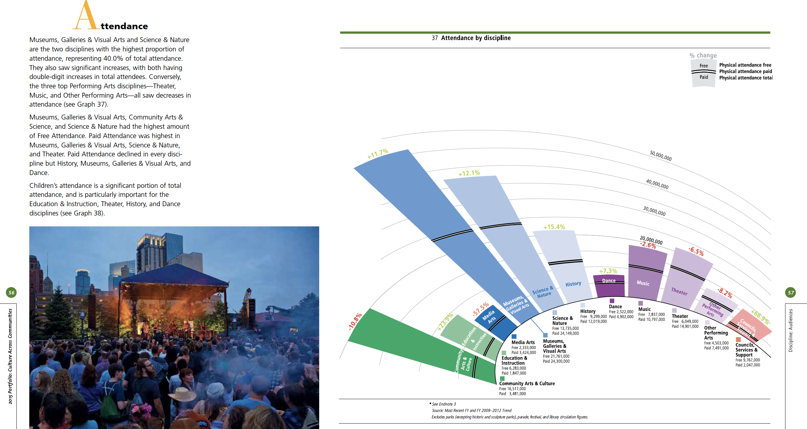
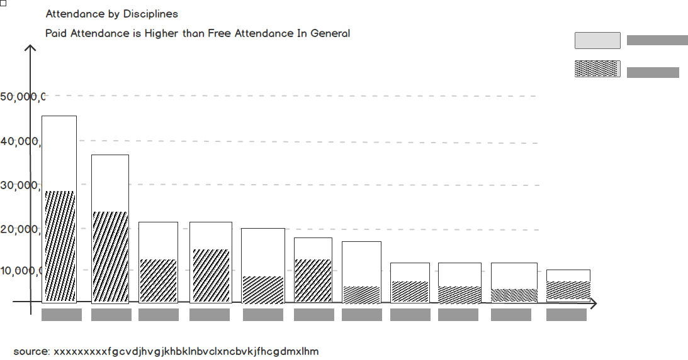
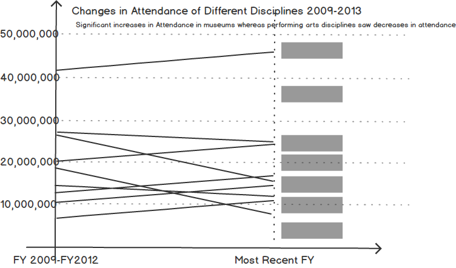
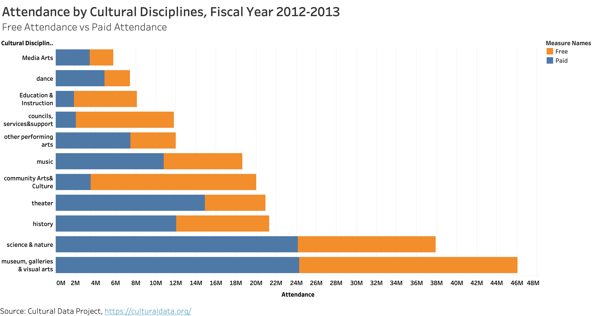
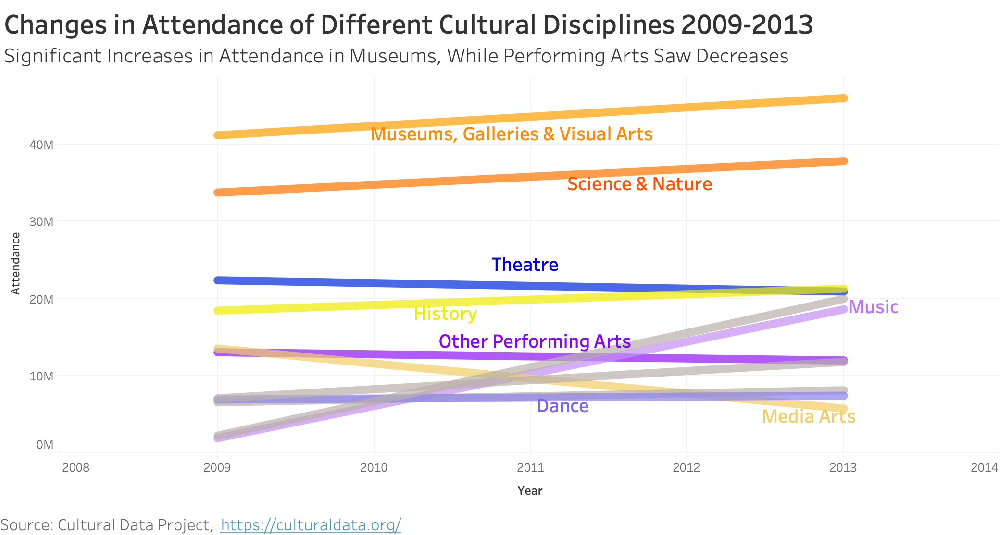

# Assignment 3&4

### written summary and analysis

Include a short paragraph on why you selected this particular data visualization.

### Wireframe a solution by using Balsamiq

I made the following changes to the original visualization.
1. The changes in the number of attendances of each discipline is an important idea this visualization trying to convey. To highlight the changes over time, I will divide this chart into two separate graphs: the stacked bar chart for showing the propositions of free and paid attendance in each discipline and the comparison of the total audience between various disciplines. For presenting the changes over time, I will make a line graph, slope or stacked area chart
2. For line chart, from the report, the core idea is to show a significant increase in visual arts and museums whereas the decrease in three top performing arts disciplines, I will group them into two categories: visual arts and performing arts
chart title: change in audience attendance to different disciplines over time
3. I will remove the black line on the bars. I will use a different shade of colors, or different texture to differentiate the free and paid attendance.
4. Remove redundancy
5. Rewriting a heading to convey the core idea
6. Make the axis vertical and horizontal
7. I will follow the current color scheme
museums, galleries, and visual arts, science and nature and history
preforming arts (dance + music +theater +other)
(education +community)
council services
But I will rearrange the order of the bars, making them descending order.

### User Feedback

### Final redesigned data visualization

A couple paragraphs describing what your process was.  You should include a few insights you gained from the critique method, and what it led you to think about when considering a redesign, if anything.  You should talk about how you moved next to the wireframes, and any insights you gleaned from your user feedback.  If it led you to change anything about your data visualization's design, mention what that was.  Finally, talk about what your redesigned data visualization shows, why you selected the data visualization you did, and what you attempted to show or do differently. 

#### Redesign #1

#### Redesign #2

