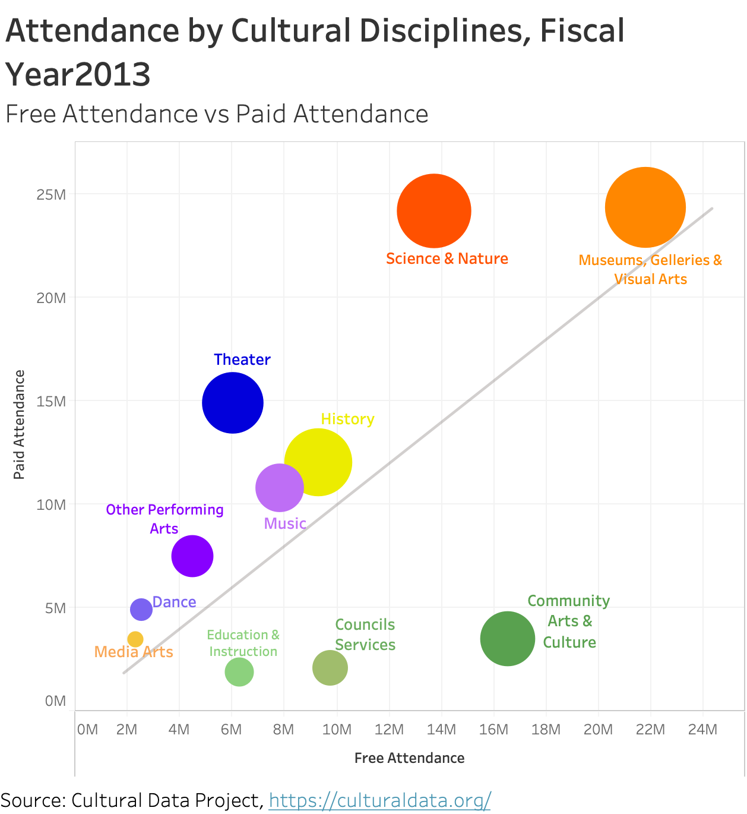
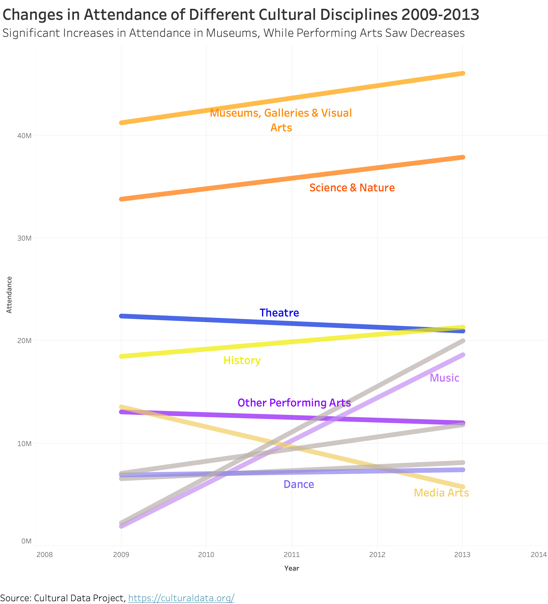

# Assignment 3&4: Critique by Design

## 1. Why I Select This Viz

### Original DataViz

https://www.issuelab.org/resource/2015-portfolio-culture-across-communities-an-eleven-city-snapshot.html
Download the report. This graph is on Page 58-59. The title of the visualization I am ranking is '37 Attendance by Discipline' 

This visualization is included in a report called _2015 Portfolio: Culture Across Communities_ published by the Great Philadelphia Cultural Alliance in 2015. Covering the activities of 5,502 organizations in 11 metros, the report reveals that, overall, cultural regions across the country are on the road to recovery from the Great Recession, with revenue, attendance, and net assets all increasing from 2009-2012.
 
This report is a perfect example of telling stories with data by presenting storytelling in visualization. Each section, including Financial Health, employment, audience, and disciplines, offers the cultural sector snapshot in the United States. The primary audience for this visualization is cultural and arts sector professionals, who want to learn about what are the pressure points for the industry, and what are the challenges and opportunities for specific disciplines. I found this visualization particularly interesting because it tries to condense a lot of data into this one single chart, and of course, its weird shape. I have never seen anything like this before. Undoubtedly, there is massive room for improvement. The purpose is to give the viewers a sense of attendance situation in different disciplines, including the proportion of free and paid attendance, total attendance in 11 disciplines, and changes in attendance number over time. Too much information makes the chart hard to read, and the critical information not being prominent.
 
My analysis begins at figuring out what are the main ideas and arguments it tries to make. According to the text beside the graph, the report wants to highlight:
1. **The changes in attendance over time** (museums, galleries, and visual arts, Science and Nature saw increases whereas the performing arts disciplines decline)
2. **The comparison between free and paid attendance between 11 disciplines**

For me, this graph is useful for the intended audience, and it has everything necessary to make it understandable. However, I think its **perceptibility (Can the reader understand the information with minimal effort), intuitiveness and aesthetics.**

## 2. Wireframe a Solution by using Balsamiq

### Wireframe-Stacked Bar Chart (to show The comparison between free and paid attendance between 11 disciplines)

### Wireframe-Line Chart (to show the changes in attendance over time)

I made the following changes to the original visualization.
1. The changes in the number of attendances of each discipline is an important idea this visualization trying to convey. To highlight the changes over time, I will divide this chart into two separate graphs: the stacked bar chart for showing the propositions of free and paid attendance in each discipline and the comparison of the total audience between various disciplines. For presenting the changes over time, I will make a line graph, slope or stacked area chart
2. For line chart, from the report, the core idea is to show a significant increase in visual arts and museums whereas the decrease in three top performing arts disciplines, I will group them into two categories: visual arts and performing arts
chart title: change in audience attendance to different disciplines over time
3. I will remove the black line on the bars. I will use a different shade of colors, or different texture to differentiate the free and paid attendance.
4. Remove redundancy
5. Rewriting a heading to convey the core idea
6. Make the axis vertical and horizontal
7. I will follow the current color scheme:
museums, galleries, and visual arts, science and nature and history
preforming arts (dance + music +theater +other)
(education +community)
council services
But I will rearrange the order of the bars, making them descending order.

## 3. User Feedback

I got some critical feedback:
1.   The first stacked bar chart is useful in showing the comparison between the total attendance in 11 disciplines and the proportion of free and paid audience in each category. However, I would love to know the relationship between the pattern of participation and different disciplines. For example, which disciplines, visual arts, or performing arts have a higher percentage of paid attendance? 
2.   In the bar chart, it is hard to see the ranking of paid and free attendance, respectively. Only total attendance.
3.   It might be not that easy to group visual arts, performing arts, and others by colors in the stacked bar chart. In Tableau, I could only use two colors for free and paid, but I cannot customize the color for each bar. (Maybe there is a way that I don’t know)

Here is the first bar chart I made in Tableau:

Therefore, I decide to change the stacked bar chart into a chart type that can show three variables (total attendance, paid attendance, and free attendance). I think scatterplot/bubble might be the right choice because it shows the comparison in free and paid attendance, and also I could size the circle to reveal the third variable: total attendance.

## 4. Final redesigned data visualization

A couple paragraphs describing what your process was.  You should include a few insights you gained from the critique method, and what it led you to think about when considering a redesign, if anything.  You should talk about how you moved next to the wireframes, and any insights you gleaned from your user feedback.  If it led you to change anything about your data visualization's design, mention what that was.  Finally, talk about what your redesigned data visualization shows, why you selected the data visualization you did, and what you attempted to show or do differently. 

#### Redesign #1

#### Redesign #2

