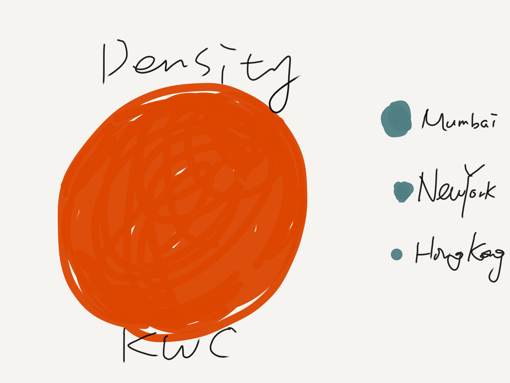
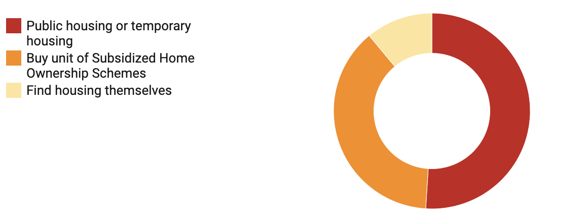
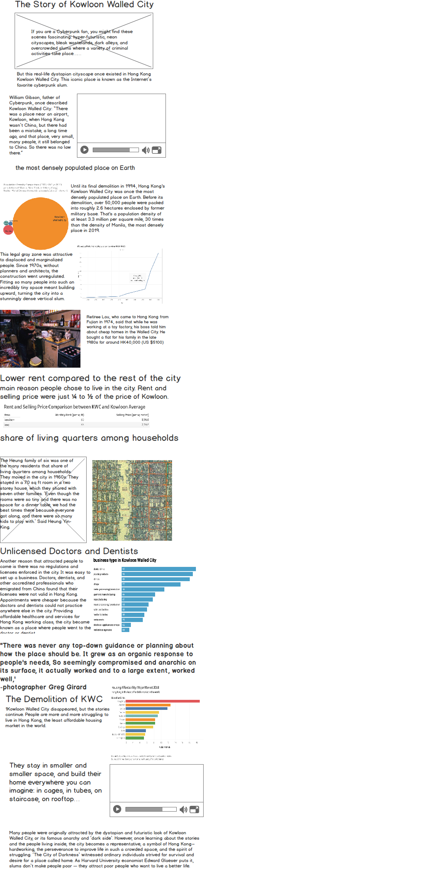
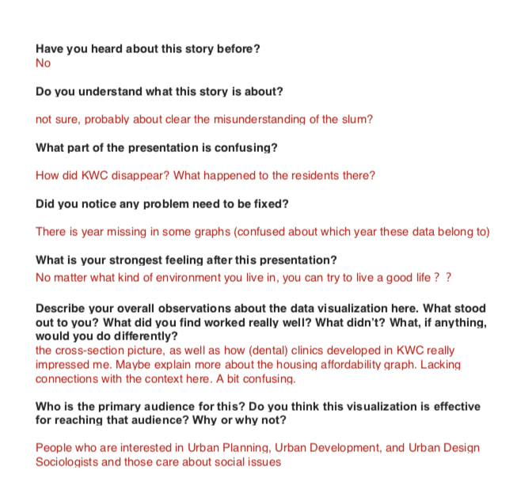
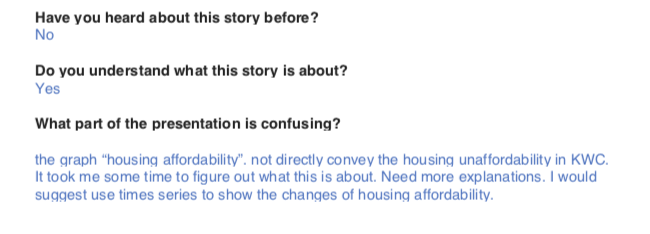
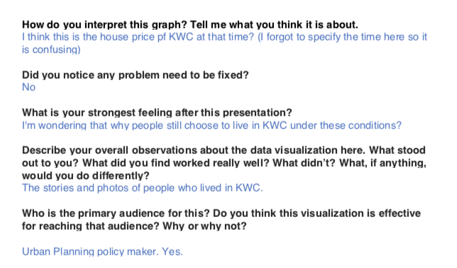
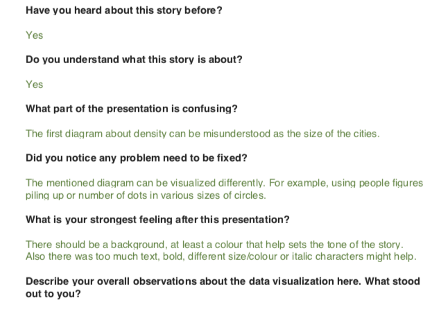
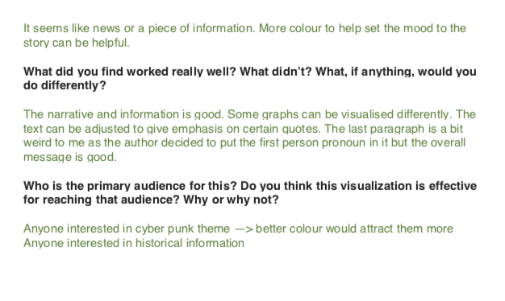

# Final Project 'Behind the Scenes'

## The Idea

### 1. The Project Outline
* teaser: a new aesthetic paradigm: a more nostalgic and romanticized version of Kowloon Walled City portrayed by popular media and game outlets
* Introduction: the city of darkness. History background
* Why special: high population density + inhabitants growth uncontrolled construction 1960-1990 
* Reason why more people choose to live in there:
1. rent
Who lived there? The story of inhabitants . 
sharing of living quarters among households
2. business and factory establishments
* 1994: the demolition . where did the people go?
* call to action: 
It is not just a cluster of buildings. It is a representative, a symbol of Hong Kong – hardworking, the perseverance to improve life in such a crowded space, the spirit of struggling. It represents certain values or spirit of struggle and resistance. 
Maybe a better solution instead of evictions and clearance? UN Sustainable Development Goal No.11: Goal 11: Make cities and human settlements inclusive, safe, resilient and sustainable
To achieve slum reduction, poliymaker should focus on preventing slums from forming, instead of mass evictions

### 2. Summary of the Project
This is a story about a place in Hong Kong called Kowloon Walled City that was demolished in 1994. It represents a unique and irreplaceable urban life and collective community memory. Therefore, this data visualization will give an inside look at how people living their life in Kowloon Walled City, a place they call, home.

### 3. Data source
I will use multiple datasets. The main datasource of Kowloon Walled City is from a research paper: Ho, S., University of Hong Kong Centre of Urban Studies, and Urban Planning. Redevelopment of Kowloon Walled City: A Feasibility Study, 1986. These data about the population, demographics, and business in KWC are all collected in 1990s.

The datasource include:
Wikipedia contributors, "List of cities by population density," Wikipedia, The Free Encyclopedia, Accessed December 2, 2019, https://en.wikipedia.org/w/index.php?title=List_of_cities_by_population_density&oldid=928164205 

Nosowitz, Dan. “Life Inside The Most Densely Populated Place On Earth [Infographic].” Popular Science. Popular Science, April 19, 2013. Accessed December 2, 2019https://www.popsci.com/technology/article/2013-04/life-inside-most-densely-populated-place-earth-infographic/#page-2. 

“Property Market Statistics.” Rating and Valuation Department, the Government of the Hong Kong Special Administrative Region. Accessed December 2, 2019. https://www.rvd.gov.hk/en/property_market_statistics/index.html.

Ho, Siu-fong, Betty. “Redevelopment of Kowloon Walled City :A Feasibility Study.” University of Hong Kong, 1986.
http://ebook.lib.hku.hk/HKG/B36228527.pdf

### Method and Medium
I will use shorthand to build the story. Because I think Shorthand is a useful tool to put all the multimedia materials together and achieve audience engagement. I will create an immersive experience by using text over media, BG scrollmation, image and video. Besides its cyberpunk elements and aesthtic value, the story will be more about the residents and their real life. Therefore, historical photos and videos will be used to ‘recreate’ the demolished city.

## Design and User Research
### Initial Sketches

population density (dataviz1)

inhabitants growth (dataviz2)

rent and price comparison between Walled City and Kowloon Average (dataviz3)

demographic structure (dataviz4)

pictures showing sharing of living quarters among households

business and factory establishments (dataviz6)

    
where did the people go? (dataviz7)

housing affordability and income gap

### Storyboard

### Moodboard

### User Research
#### Target Audience
people interested in urban history and urban development. 
Cyberpunk fan

#### Goals
1. Evaluate if the storytelling narrative is clear enough
2. Evaluate if the data visualizations effective in telling story
3. Identify the unclear and confusing parts and what needs to be fixed

#### Research questions
1.	Have you heard about this story before? Do you understand what this story is about?
2.	What part of the presentation is confusing?
3.	Did you notice any problem need to be fixed?
4.	What is your strongest feeling after this presentation?
5.	Describe your overall observations about the data visualization here. What stood out to you? What did you find worked really well? What didn't? What, if anything, would you do differently?
6.	Who is the primary audience for this? Do you think this visualization is effective for reaching that audience? Why or why not?

#### Script:
I interviewed three people from different background: Journalism, Econ & Finance Policy, and Arts Management, 2 female, 1 male. One of them are familar with Cyberpunk culture. I hope they can bring different perspectives to this project.

#### Findings:
1. Unclear parts: the ending of KWC. Housing crisis graph. The connection between the graph and context. 
2. Graph need to be improved: density graph (can be misundertood as the size?) change to a better way to show population density
3. too much text + no background color--> use dark color to set the tone

## Final data story
### Intended Audience
The intended audience will be people who are interested in urban history and urban development, and policymakers. 
I told the story of KWC from different dimensions: its history timeline, real data of population and changes through time combining the social contexts back that time. The data could effectively demonstrate what kind of existance KWC was that time, and what happened in Hong Kong: the issue of rapid population growth and housing shortages. I think these will be working well in enagaging those who are interested in urban history and sociology. Also I used various media tools such as images and documentary to keep the audience engaged. 

### Relection on the work
1. The most challenging part for me is that how to make your story compelling, that is, how to make your audience be the hero of your story, and what is your call to action, what you want your audience get from your story.
Especially nowadays, when people's attention has become a scarce commodity, and everyone is trying to sell people their ideas, 
answering the question 'why would I care about what you are saying' is the key to tell the story successfully.

2. Doing user research is crucial in ensuring the whole story engaging. This step helped me improve my story structure a lot.

### Link to the final project

## References

### Pictures

[Silhouette Photo of Person Walking in Alley] (https://www.pexels.com/photo/silhouette-photo-of-person-walking-in-alley-3029352/) by Aleksandar Pasaric licensed under Pexels license 

["cyberpunk 1"] (https://www.behance.net/gallery/75440891/cyberpunk-1) by Sheam Bo is licensed under CC BY 4.0 

[vaporwave photo] (https://www.behance.net/gallery/75440891/cyberpunk-1) under public domain license

["Hong Kong Illustrations"] (https://www.behance.net/gallery/53380177/Hong-Kong-Illustrations) by Evgeny Bondarenko is licensed under CC BY-NC-ND 4.0 

All the rest of images: [Kowloon Walled City 九龍城寨 - Photos - 80年代-02.jpg] (https://www.flickr.com/photos/eager/7243372632/) by 準建築人手札網站 Forgemind ArchiMedia is licenced under CC BY 2.0Data 

### Data

Wikipedia contributors, "List of cities by population density," Wikipedia, The Free Encyclopedia, Accessed December 2, 2019, https://en.wikipedia.org/w/index.php?title=List_of_cities_by_population_density&oldid=928164205 

Nosowitz, Dan. “Life Inside The Most Densely Populated Place On Earth [Infographic].” Popular Science. Popular Science, April 19, 2013. Accessed December 2, 2019https://www.popsci.com/technology/article/2013-04/life-inside-most-densely-populated-place-earth-infographic/#page-2. 

“Property Market Statistics.” Rating and Valuation Department, the Government of the Hong Kong Special Administrative Region. Accessed December 2, 2019. https://www.rvd.gov.hk/en/property_market_statistics/index.html.

Ho, Siu-fong, Betty. “Redevelopment of Kowloon Walled City :A Feasibility Study.” University of Hong Kong, 1986.

### Research

1. Girard, Greg, and Ian Lambot. City of Darkness. Somerset: Watermark Publ., 1993.2. Ho, Siu-fong, Betty. “Redevelopment of Kowloon Walled City :A Feasibility Study.” University of Hong Kong, 1986.

3. “25 Years on, the Kowloon Walled City Still Evokes Awe and Revulsion.” South China Morning Post, March 23, 2018. https://www.scmp.com/news/hong-kong/community/article/2138495/rats-were-something-else-25-years-hong-kongs-kowloon-walled.

4. “Kowloon Walled City: Life in the City of Darkness.” South China Morning Post, February 12, 2015. https://www.scmp.com/news/hong-kong/article/1191748/kowloon-walled-city-life-city-darkness.

5. Sinn, Elizabeth. “Kowloon Walled City: Its Origin and Early History.” Journal of the Hong Kong Branch of the Royal Asiatic Society, 1987, 30–45.

6. DeHart, Jonathan. “Kowloon Walled City: Anarchy and Inspiration in the City of Darkness.” – The Diplomat. for The Diplomat, September 30, 2013. https://thediplomat.com/2013/04/kowloon-walled-city-anarchy-and-inspiration-in-the-city-of-darkness/.

7. Mead, Derek. “A New Look at Kowloon Walled City, the Internet's Favorite Cyberpunk Slum.” Vice, April 3, 2014. https://www.vice.com/en_us/article/kbzwvm/a-new-look-at-kowloon-walled-city-the-internets-favorite-cyberpunk-slum.
8. 鲁金. 九龙城寨史话. 三聯書店(香港)有限公司, 1988.

