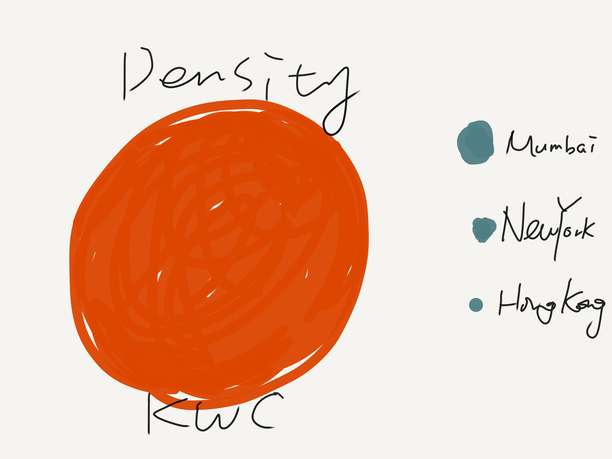
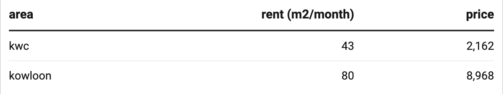
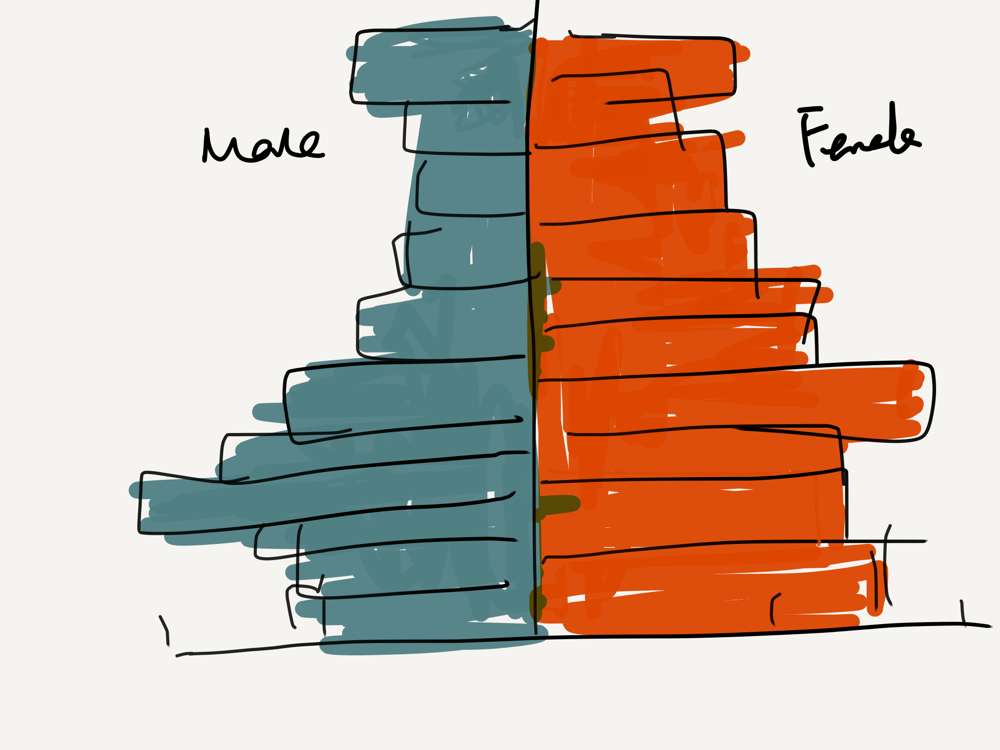
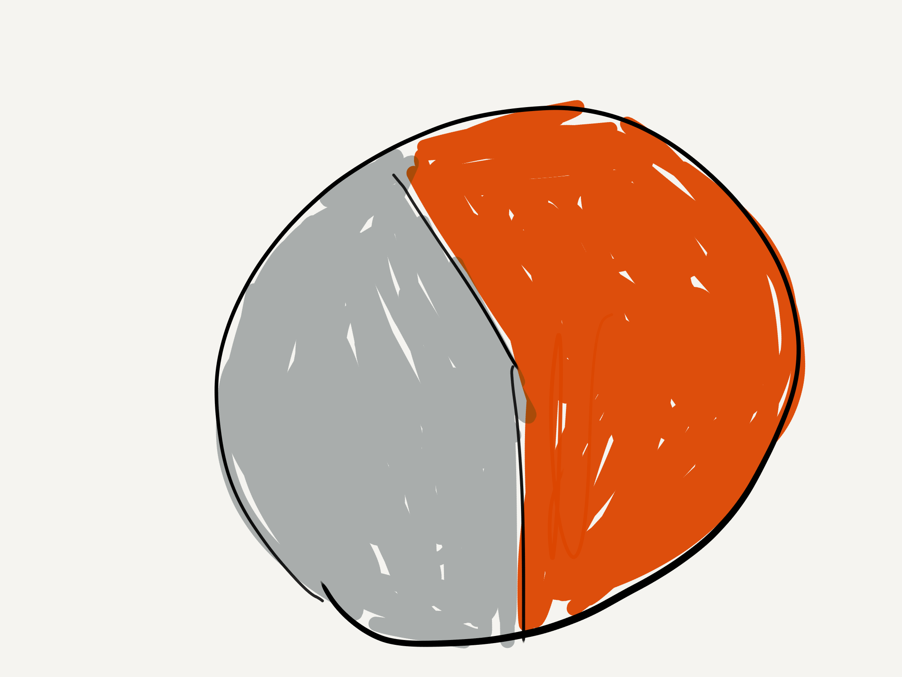
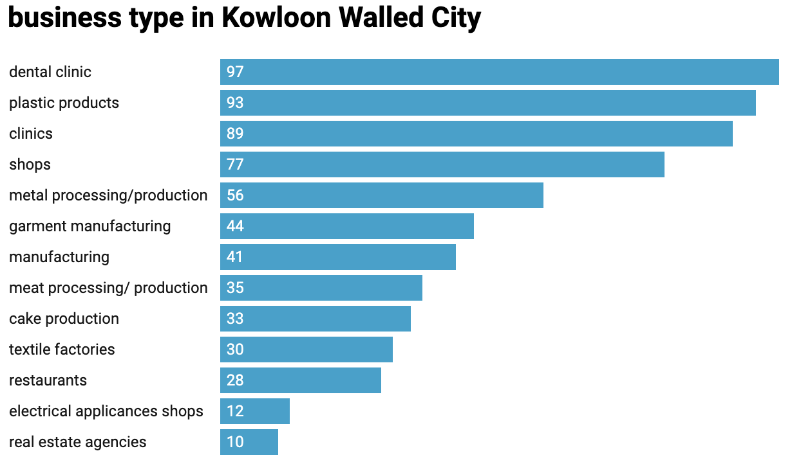
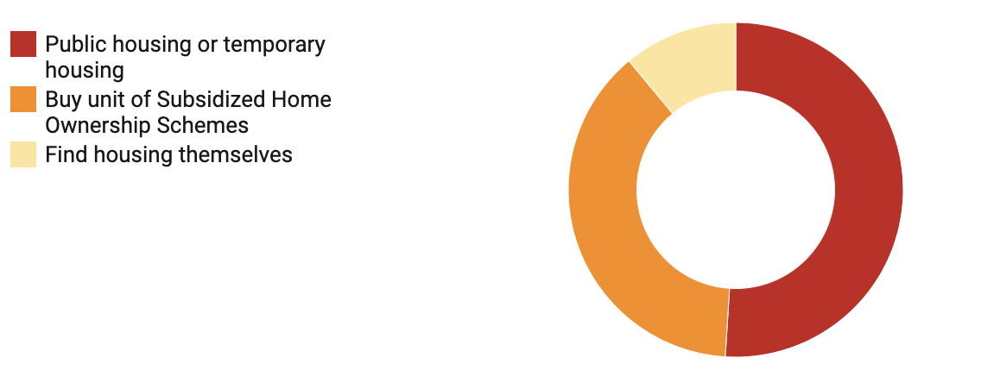
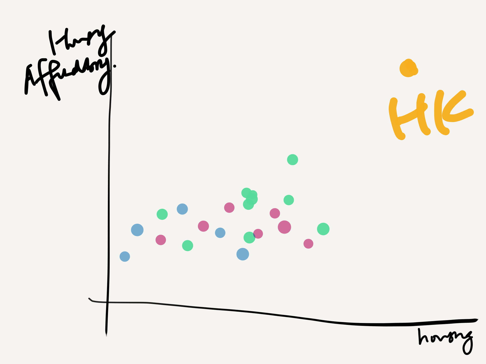

# Part 1

## An outline

For the final project, I want to tell the story of **Hong Kong Kowloon Walled City (九龙寨城）**, once the most crowded place on Earth. It is well known for its dark and bizzare side: dystopia, anarchy, slum, crime, lawless, cyberpunk...But Kowloon Walled City is more than just these descriptions. **It represents a unique and irreplaceable urban life and collective community memory.** Therefore, this data visualization will give an inside look at how people living their life in Kowloon Walled City, a place they call, home.

**Story Structure:**
1. teaser: **a new aesthetic paradigm**: a more nostalgic and romanticized version protrayed by popular media and game outlets
2. Introduction: the city of darkness. background 
3. population density + inhabitants growth 
uncontrolled construction
1960-1990 the housing affordability crisis
hong kong housing price 
4. Reason why more people choose to live in there---rent 
5. Who lived in there? The story of inhabitants
* demographic structure 
* sharing of living quarters among households
* business and factory establishments

oral history + picture
6. 1994: the demolition . 
where did the people go?
7. **call to action: beyond the striking images: care about and respect the people behind** . 
Although it looks like a dystopia, nobody can deny the fact that the Kowloon Walled City once provided those in need with a place called home.

## Initial Sketches

population density (dataviz1)

inhabitants growth (dataviz2)

rent and price comparison between Walled City and Kowloon Average (dataviz3)

demographic structure (dataviz4)

pictures showing sharing of living quarters among households

business and factory establishments (dataviz6)

    
where did the people go? (dataviz7)

housing affordability and income gap

## The data
I will use multiple datasets. The main datasource of Kowloon Walled City is a research paper: Ho, S., University of Hong Kong Centre of Urban Studies, and Urban Planning. Redevelopment of Kowloon Walled City: A Feasibility Study, 1986.

Following are the datasources I used:
* density of population:
https://www1.nyc.gov/site/planning/planning-level/nyc-population/population-facts.page

https://en.wikipedia.org/wiki/Kowloon_Walled_City

http://worldpopulationreview.com/world-cities/mumbai-population/

* inhabitants change:
https://en.wikipedia.org/wiki/Kowloon_Walled_City#Population

* Rent: Hong Kong Government Rating and Evaluation Department webiste
https://www.rvd.gov.hk/en/property_market_statistics/index.html

* demographic structure:

research paper
http://ebook.lib.hku.hk/HKG/B36228527.pdf

* the number of business and factory information: the Kowloon Walled City Kai Fong Welfare Advancement Association 

research paper
http://ebook.lib.hku.hk/HKG/B36228527.pdf

* the destination of clearees after demolition: The Hong Kong Housing Authority

research paper
http://ebook.lib.hku.hk/HKG/B36228527.pdf

* housing affordability and income gap:
https://data.oecd.org/inequality/income-inequality.htm

http://www.demographia.com/dhi.pdf

## Method and Medium
I will use shorthand to build the story. Because I think Shorthand is a useful tool to put all the multimedia materials together and achieve audience engagement. I will create an immersive experience by using text over media, BG scrollmation, image and video. Besides its cyberpunk elements and aesthtic value, the story will be more about the residents and their real life. Therefore, historical photos and videos will be used to 'recreate' the demolished city. 

potential images or video:

[Documentary](https://www.youtube.com/watch?v=dj_8ucS3lMY&t=546s/ )

[photos by Gred Girard](http://www.greggirard.com/work/kowloon-walled-city--13/ )

