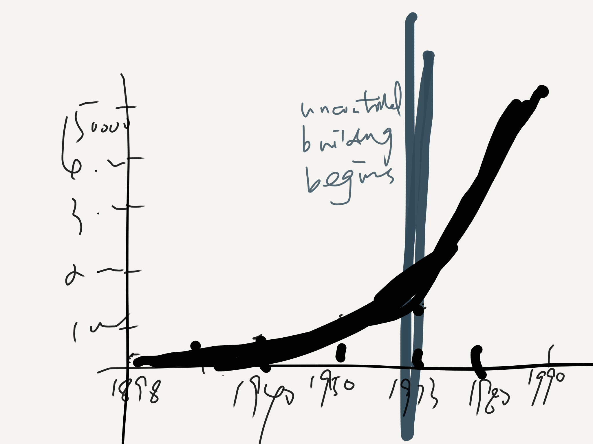

# An outline

For the final project, I want to tell the story of **Hong Kong Kowloon Walled City (九龙寨城）**, once the most crowded place on Earth. It is well known for its dark and bizzare side: dystopia, anarchy, slum, crime, lawless, cyberpunk...But Kowloon Walled City is more than just these descriptions. **It represents a unique and irreplaceable urban life and collective community memory.** Therefore, this data visualization will give an inside look at how people living their life in Kowloon Walled City, a place they call, home.

Story Structure:
1. teaser: **a new aesthetic paradigm**: a more nostalgic and romanticized version protrayed by popular media and game outlets
2. Introduction: the city of darkness. background 
3. population density (dataviz1) + inhabitants growth (dataviz2)

uncontrolled construction
1960-1990 the housing affordability crisis
hong kong housing price (dataviz)
4. Reason why more people choose to live in there---rent (dataviz3)
5. Who lived in there? The story of inhabitants
demographic structure (dataviz4)
pictures showing sharing of living quarters among households
“life was poor, but we were very happy’
oral history + picture
dataviz5
business and factory establishments (dataviz6)
oral history + picture
6. 1994: the demolition
where did the people go? (dataviz7)
7. **call to action: beyond the striking images: care about and respect the people behind**
Although it looks like a dystopia, nobody can deny the fact that the Kowloon Walled City once provided those in need with a place called home.

# The data
# Method and Medium
shorthand
