## (1) Wirefames / storyboard for user feedback

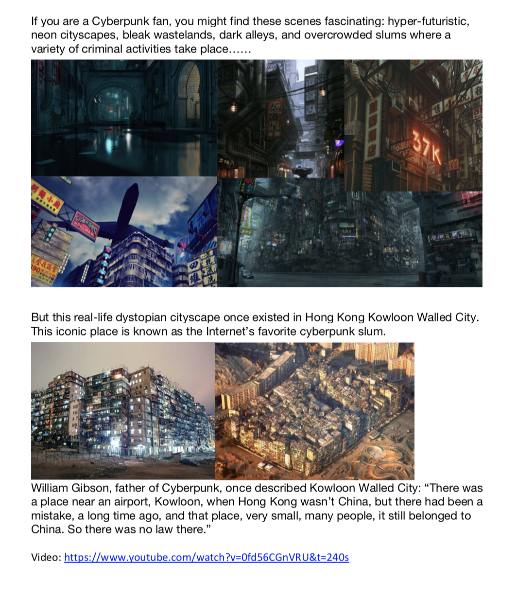
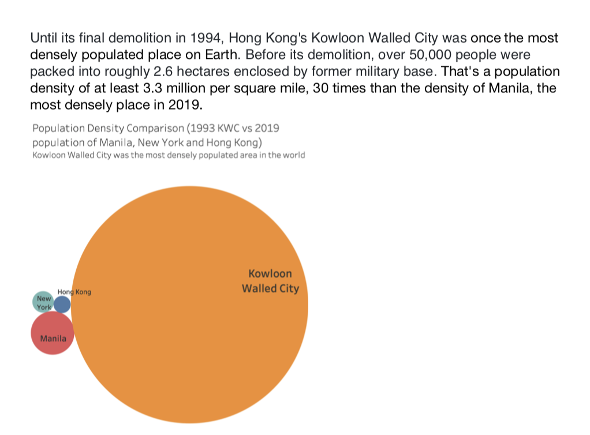

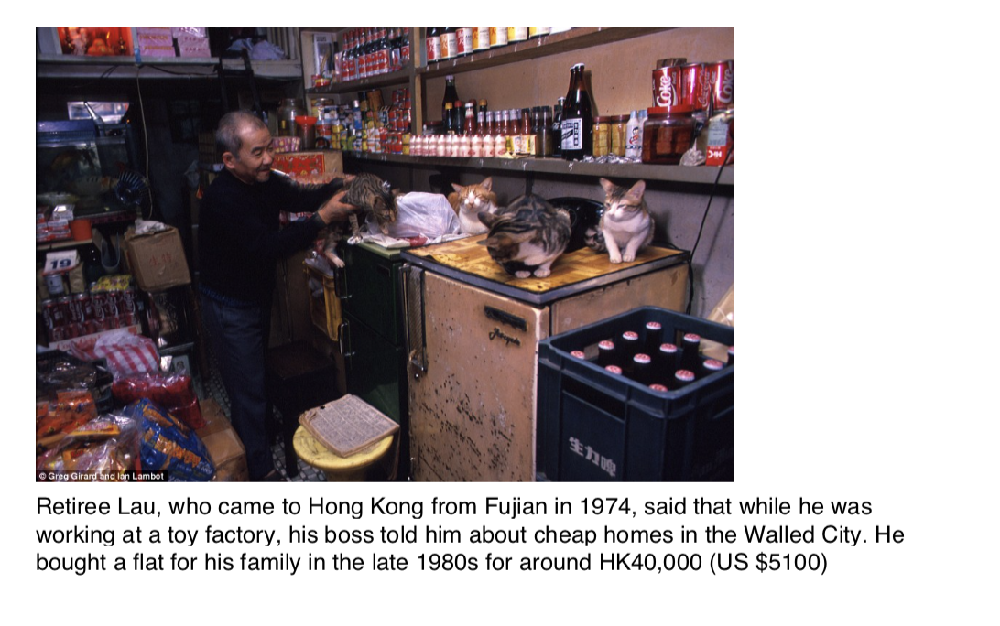
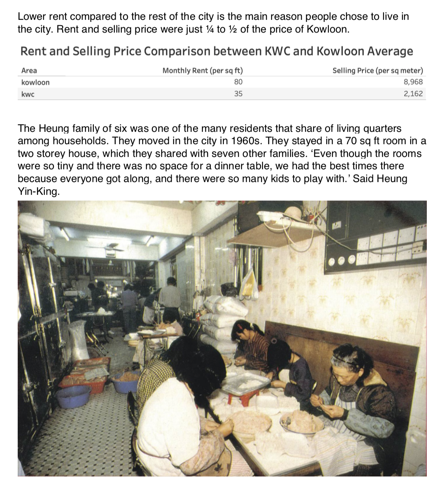
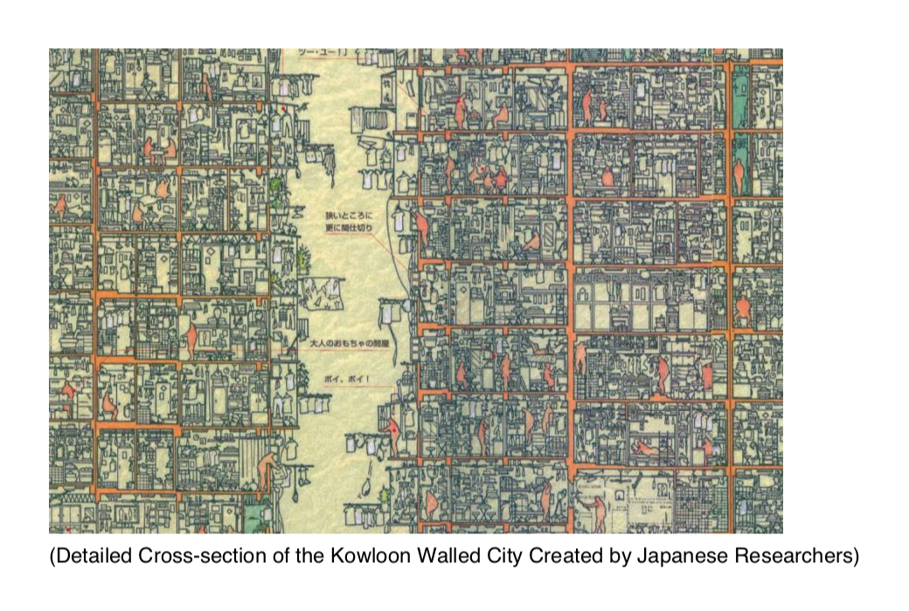
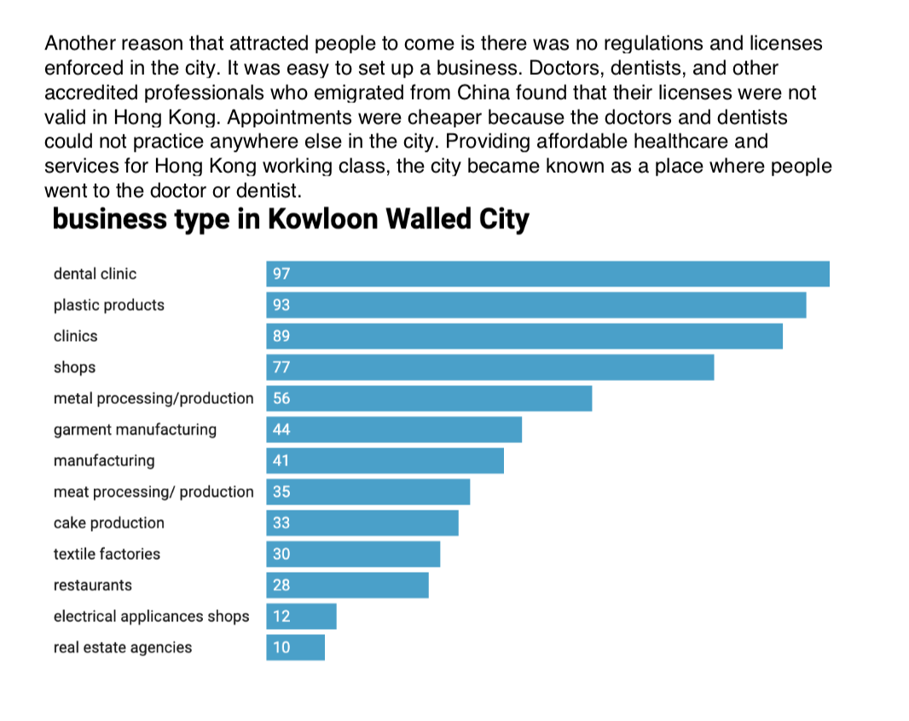
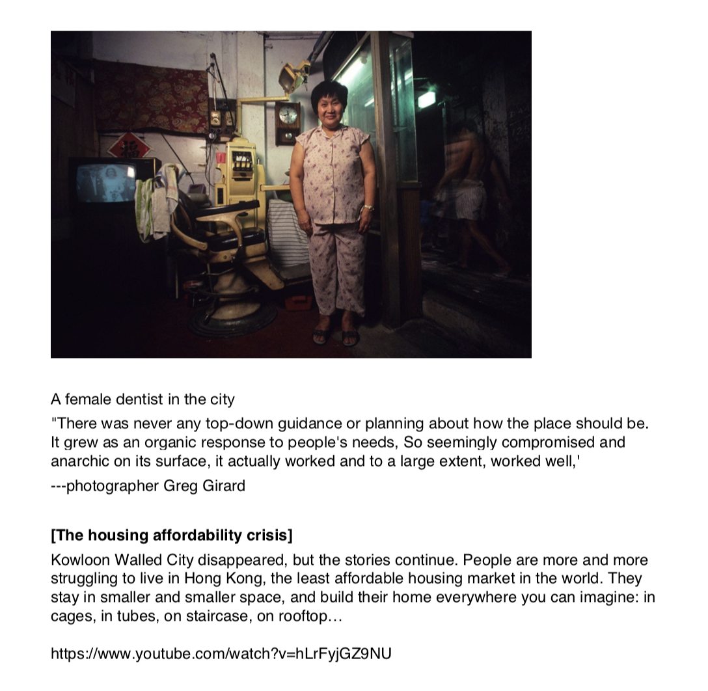
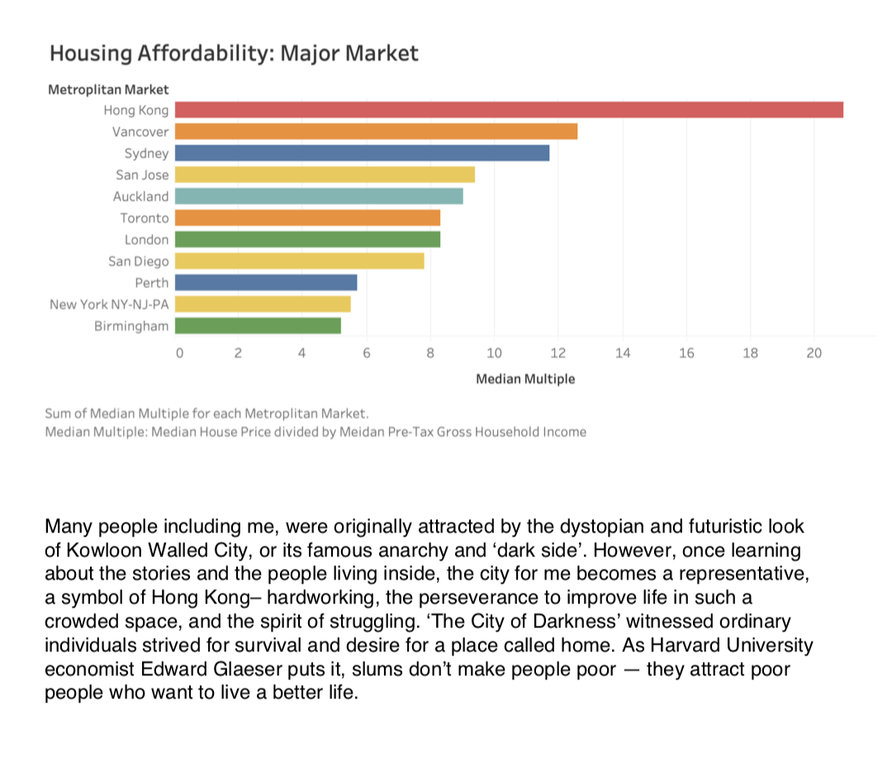

## (2) Creation of a user research protocol and completion of at least three interviews

### Target Audience
people interested in urban history and urban development. 
Cyberpunk fan

### Goals
1. Evaluate if the storytelling narrative is clear enough
2. Evaluate if the data visualizations effective in telling story
3. Identify the unclear and confusing parts and what needs to be fixed

### Research questions
1.	Have you heard about this story before? Do you understand what this story is about?
2.	What part of the presentation is confusing?
3.	Did you notice any problem need to be fixed?
4.	What is your strongest feeling after this presentation?
5.	Describe your overall observations about the data visualization here. What stood out to you? What did you find worked really well? What didn't? What, if anything, would you do differently?
6.	Who is the primary audience for this? Do you think this visualization is effective for reaching that audience? Why or why not?

### Script:
I interviewed three people from different background: Journalism, Econ & Finance Policy, and Arts Management, 2 female, 1 male. One of them are familar with Cyberpunk culture. I hope they can bring different perspectives to this project.

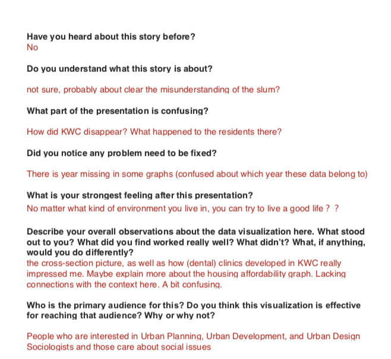
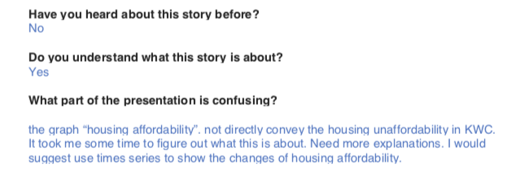
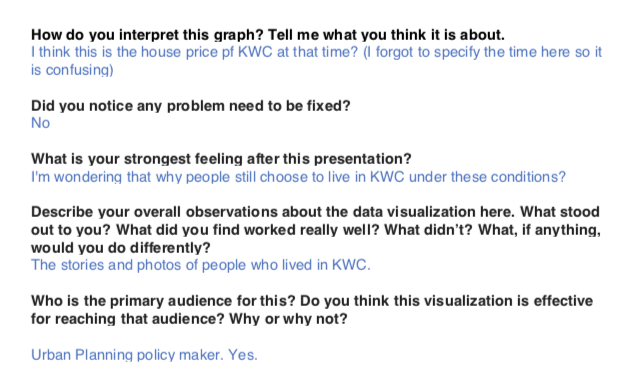
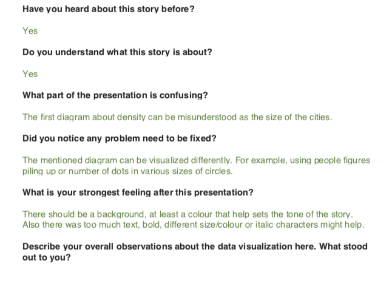
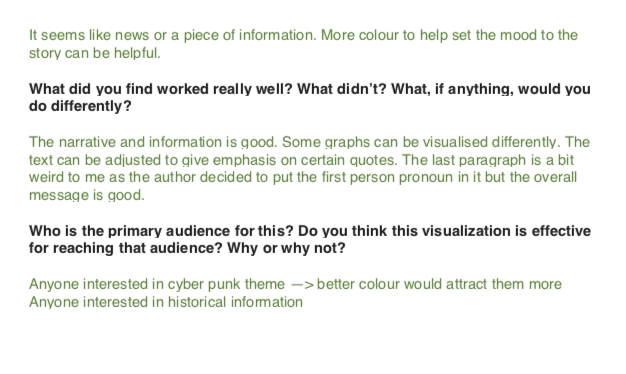

### Findings:
1. Unclear parts: the ending of KWC. Housing crisis graph. The connection between the graph and context. 
2. Graph need to be improved: density graph (can be misundertood as the size?) change to a better way to show population density
3. too much text + no background color--> use dark color to set the tone

## (3) Revised wireframes / visualizations / storyboards based on what you heard

Based on the feedback I received, I decided to add a moodboard, displaying visual elements and setting the tone for my storytelling.

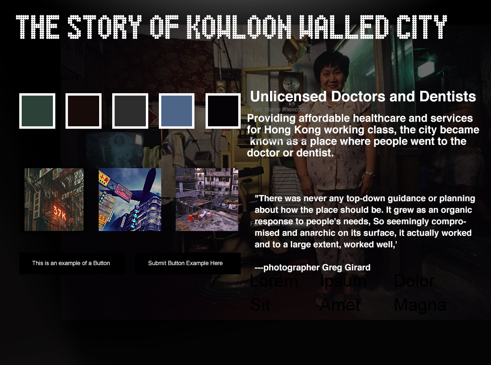

i will also delete the heading of 'housing affordability issue' and change it to 'The demolition of kwc'

Here is the new storyboard:
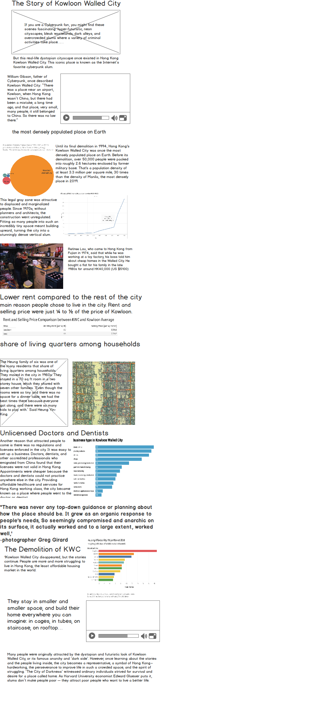

Source of Pictures:
https://twitter.com/josefbsharah/status/856537901227802626
https://bassman5911.tumblr.com/post/61635974226/metropolis225-am-by-toshio-hatanaka
https://imgur.com/r/Cyberpunk/TCEvRfT
https://roboticnetwork.tumblr.com/post/73250724341/tacticalneuralimplant-kowloon-walled-city
https://www.deviantart.com/scifilicious/art/GHOST-IN-THE-SHELL-95-Tribute-785127354

