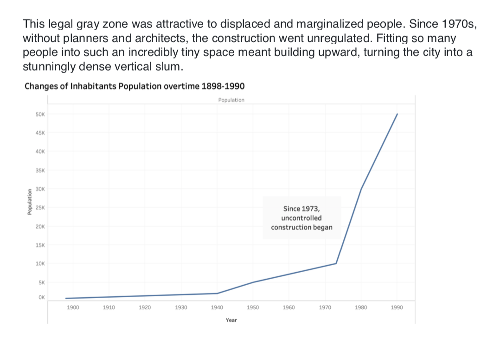

## (1) Wirefames / storyboard for user feedback

## (2) Creation of a user research protocol and completion of at least three interviews

### Goals
1. Evaluate if the storytelling narrative is clear enough
2. Evaluate if the data visualizations effective in telling story
3. Identify the unclear and confusing parts and what needs to be fixed

### Research questions:
1.	Have you heard about this story before? Do you understand what this story is about?
2.	What part of the presentation is confusing?
3.	Did you notice any problem need to be fixed?
4.	What is your strongest feeling after this presentation?
5.	Describe your overall observations about the data visualization here. What stood out to you? What did you find worked really well? What didn't? What, if anything, would you do differently?
6.	Who is the primary audience for this? Do you think this visualization is effective for reaching that audience? Why or why not?

### Script:

### Findings:
